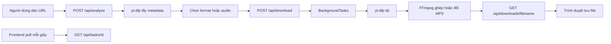

# 2T Web Downloader

[](LICENSE)
[](https://www.python.org/)
[](https://react.dev/)
[](https://fastapi.tiangolo.com/)

**2T Web Downloader** là công cụ tải video và âm thanh trực tuyến nhanh chóng, cho phép người dùng phân tích liên kết, lựa chọn chất lượng phù hợp và lưu nội dung về thiết bị một cách thuận tiện.

2T Web Downloader phân tích liên kết, hiển thị metadata, cho phép chọn chất lượng và theo dõi tiến độ tải. Ứng dụng có giao diện Việt/Anh, chế độ sáng/tối và hai chế độ lưu file dành cho máy cá nhân hoặc máy chủ.

- **Repository:** <https://github.com/Tuantai17/2T-Web-Downloader>
- **License:** [MIT](LICENSE)

> **Lưu ý pháp lý:** Chỉ tải nội dung bạn sở hữu hoặc được phép tải. Người dùng chịu trách nhiệm tuân thủ bản quyền, điều khoản nền tảng và pháp luật địa phương.

## Mục lục

- [Tính năng](#tính-năng)
- [Nền tảng hỗ trợ](#nền-tảng-hỗ-trợ)
- [Cách hoạt động](#cách-hoạt-động)
- [Cấu trúc và công nghệ](#cấu-trúc-và-công-nghệ)
- [Cài đặt trên Windows](#cài-đặt-trên-windows)
- [Cấu hình](#cấu-hình)
- [Khởi chạy và sử dụng](#khởi-chạy-và-sử-dụng)
- [API](#api)
- [Kiểm tra và build](#kiểm-tra-và-build)
- [Giới hạn](#giới-hạn)

## Tính năng

### Đã triển khai

- Phân tích URL mà chưa tải file.
- Hiển thị tiêu đề, thumbnail, thời lượng và nền tảng nguồn.
- Liệt kê, chuẩn hóa và loại bỏ format trùng nhau.
- Chọn tự động chất lượng tốt nhất hoặc format cụ thể, đến 8K nếu nguồn có.
- Audio-only; chuyển MP3 192 kbps khi có FFmpeg.
- Ghép video và audio bằng FFmpeg.
- Hiển thị phần trăm, tốc độ, ETA và giai đoạn xử lý.
- Tự chuyển file hoàn tất đến trình duyệt.
- Giao diện Việt/Anh, sáng/tối; theme lưu trong `localStorage`.
- Chế độ `local` và `production`.
- Swagger UI/OpenAPI tự động.

### Chưa triển khai

Các chức năng tải hàng loạt, pause/resume/cancel, lịch sử database, WebSocket, đăng nhập/API key và API cập nhật cấu hình chưa có trong source hiện tại. Frontend theo dõi task bằng polling mỗi giây.

## Nền tảng hỗ trợ

2T Web Downloader có thể phân tích và tải nội dung công khai từ nhiều nền tảng phổ biến, bao gồm:

| Nhóm | Nền tảng tiêu biểu |
|---|---|
| Video | YouTube, Vimeo, Dailymotion, Rumble, Bilibili |
| Mạng xã hội | Facebook, Instagram, TikTok, X (Twitter), Reddit |
| Livestream và gaming | Twitch, Kick, Streamable |
| Âm thanh | SoundCloud, Bandcamp, Mixcloud |
| Truyền thông | BBC, CNN và nhiều website tin tức có video công khai |

Khả năng tải phụ thuộc vào URL cụ thể và nội dung phải có quyền truy cập hợp lệ; một số video riêng tư, trả phí, giới hạn khu vực hoặc được bảo vệ bằng DRM có thể không tải được.

## Cách hoạt động



1. Frontend đọc `GET /api/settings`.
2. `/api/analyze` gọi yt-dlp với `download=False`.
3. Backend chuẩn hóa codec, độ phân giải và dung lượng ước tính.
4. `/api/download` tạo UUID và chạy bằng `FastAPI BackgroundTasks`.
5. Progress hooks cập nhật dictionary trong RAM.
6. Frontend gọi `/api/tasks/{task_id}` mỗi giây.
7. Khi hoàn tất, frontend lấy file qua `/api/downloads/{filename}`.
8. Production xóa file sau khi phục vụ; local giữ file.

## Cấu trúc và công nghệ

```text
2T-Web-Downloader/
├── .gitignore
├── LICENSE                       # Giấy phép MIT
├── README.md                     # Tài liệu chính
├── backend/
│   ├── .env.example              # Mẫu biến môi trường
│   ├── requirements.txt          # Dependency Python
│   ├── alembic/                  # Skeleton migration cũ
│   └── app/
│       ├── main.py               # FastAPI và endpoint
│       ├── config.py             # Cấu hình môi trường
│       ├── schemas.py            # Pydantic schema
│       └── engine/downloader.py  # yt-dlp, FFmpeg, progress
└── frontend/
    ├── package.json              # Dependency và npm scripts
    └── src/
        ├── App.tsx               # API flow và polling
        ├── config.ts             # API base URL
        ├── i18n.ts               # Đa ngôn ngữ
        ├── components/           # Các thành phần giao diện
        └── locales/              # Bản dịch Việt/Anh
```

**Frontend:** React 19, TypeScript, Vite 8, Tailwind CSS 4, Framer Motion, Lucide, i18next, Embla Carousel và OXLint.

**Backend:** Python, FastAPI, Uvicorn, Pydantic, yt-dlp và FFmpeg. SQLAlchemy/Alembic còn trong dependency/skeleton nhưng API hiện tại không dùng database.

> `backend/test_e2e.py` tham chiếu kiến trúc database và chữ ký engine cũ nên hiện không chạy được nếu chưa cập nhật.

## Cài đặt trên Windows

Yêu cầu: Windows 10/11, Python 3.10+, Node.js LTS mới, npm, Internet và đủ dung lượng ổ đĩa.

### Backend

```powershell
cd backend
python -m venv venv
Set-ExecutionPolicy -Scope Process -ExecutionPolicy Bypass
.\venv\Scripts\Activate.ps1
python -m pip install --upgrade pip
pip install -r requirements.txt
pip install python-dotenv imageio-ffmpeg
Copy-Item .env.example .env -ErrorAction SilentlyContinue
```

`python-dotenv` được source import trực tiếp và `imageio-ffmpeg` được dùng để tự tìm FFmpeg. Hai gói chưa được khai báo trong `requirements.txt`, do đó lệnh cài đặt ở trên bổ sung chúng riêng. Đây là điểm cần đồng bộ trong phiên bản tiếp theo.

### Frontend

```powershell
cd frontend
npm install
```

`venv`, `node_modules` và `dist` có thể tạo lại, không nên commit.

## Cấu hình

Backend đọc `backend/.env` hoặc biến môi trường:

| Biến | Mặc định | Ý nghĩa |
|---|---|---|
| `APP_MODE` | `local` | `local` hoặc `production`. |
| `DOWNLOAD_DIR` | Theo mode | Thư mục lưu tùy chỉnh. |
| `CLEANUP_AFTER_DOWNLOAD` | Theo mode | Chính sách cleanup hiển thị trong settings. |
| `MAX_HISTORY_ITEMS` | `100` | Đã đọc nhưng chưa dùng vì chưa có lịch sử. |

```dotenv
APP_MODE=local
DOWNLOAD_DIR=E:\Downloads\2T-Downloader
CLEANUP_AFTER_DOWNLOAD=false
MAX_HISTORY_ITEMS=100
```

| Hành vi | Local | Production |
|---|---|---|
| Thư mục mặc định | `backend/downloads` | `backend/temp_downloads` |
| Sau khi trình duyệt nhận file | Giữ file | Xóa file |

Route phục vụ file quyết định cleanup trực tiếp theo `APP_MODE=production`. Frontend dùng API `http://localhost:8000` trong `frontend/src/config.ts`; sửa file nếu backend dùng địa chỉ khác.

## Khởi chạy và sử dụng

### Backend

```powershell
cd backend
.\venv\Scripts\Activate.ps1
python -m uvicorn app.main:app --host 0.0.0.0 --port 8000 --reload
```

- Swagger: <http://localhost:8000/docs>
- OpenAPI: <http://localhost:8000/openapi.json>
- `/` có thể trả 404 vì source không khai báo route gốc.

### Frontend

```powershell
cd frontend
npm run dev
```

Mở URL Vite in trong terminal, thường là <http://localhost:5173>.

### Sử dụng

1. Dán URL và bấm phân tích.
2. Kiểm tra metadata và format.
3. Chọn **Auto**, format cụ thể hoặc **Audio Only**.
4. Bấm tải và theo dõi tiến độ.
5. Trình duyệt tự nhận file khi hoàn tất.

Auto chọn video/audio tốt nhất. Format cụ thể được ghép audio tốt nhất khi có FFmpeg. Audio Only lấy audio tốt nhất và chuyển MP3 192 kbps khi có FFmpeg. Tên file có dạng `Tiêu đề [video_id].ext`.

Preview dùng URL stream trực tiếp; CORS, referrer, URL hết hạn hoặc codec có thể khiến preview không phát dù tải file vẫn hoạt động.

## API

Base URL: `http://localhost:8000`.

### `POST /api/analyze`

```json
{ "url": "https://example.com/video" }
```

Trả metadata và `formats`; lỗi trả HTTP 400 với `detail`.

### `POST /api/download`

```json
{
  "url": "https://example.com/video",
  "format_id": "137",
  "audio_only": false
}
```

Response:

```json
{
  "message": "Download started",
  "task_id": "92bbf23a-3cc9-46b8-91b3-96b3185f1591"
}
```

`url` bắt buộc. Schema còn nhận title, thumbnail, platform, duration và resolution nhưng engine chỉ dùng URL, format ID và audio-only.

### `GET /api/tasks/{task_id}`

```json
{
  "task_id": "92bbf23a-3cc9-46b8-91b3-96b3185f1591",
  "status": "DOWNLOADING",
  "stage": "Downloading... (42.5%)",
  "progress": 42.5,
  "speed": 2541180,
  "eta": 18,
  "downloaded_bytes": 52428800,
  "total_bytes": 123000000,
  "filename": null,
  "error_message": null
}
```

Trạng thái: `QUEUED`, `PREPARING`, `DOWNLOADING`, `MERGING`, `POST_PROCESSING`, `COMPLETED`, `FAILED`. Frontend hiểu `CANCELLED` nhưng backend chưa tạo trạng thái này.

### `GET /api/settings`

Trả thư mục tải, mode, trạng thái/path FFmpeg, phiên bản yt-dlp và chính sách cleanup.

### `GET /api/downloads/{filename}`

Trả file hoàn tất; 404 nếu không tồn tại. Filename phải URL-encode. Production lên lịch xóa file sau khi phục vụ.

Ví dụ PowerShell:

```powershell
Invoke-RestMethod http://localhost:8000/api/settings

Invoke-RestMethod `
  -Uri 'http://localhost:8000/api/analyze' `
  -Method Post `
  -ContentType 'application/json' `
  -Body '{"url":"https://example.com/video"}'
```

## Kiểm tra và build

```powershell
cd frontend
npm run lint
npm run build
```

Build tạo `frontend/dist`. Kiểm tra backend qua `/api/settings` hoặc Swagger. Test E2E cũ cần viết lại trước khi dùng trong CI.

## Giới hạn

- Task chỉ nằm trong RAM; restart làm mất tiến độ.
- Không rate limit, xác thực, quota hoặc giới hạn số task.
- BackgroundTasks không phải queue bền vững hay đa máy chủ.
- Không hủy task, không lịch sử, không tự dọn task RAM cũ.
- Không scheduler dọn file nếu trình duyệt không nhận file.
- UI không truyền cookie, proxy hoặc header tùy chỉnh.
- Không hỗ trợ DRM.
- Không có FFmpeg có thể làm format cao không tiếng; audio-only có thể không thành MP3.
- CORS hiện mở mọi origin.
- Route file cần gia cố chống path traversal trước khi public.
- yt-dlp và website nguồn thay đổi thường xuyên.

